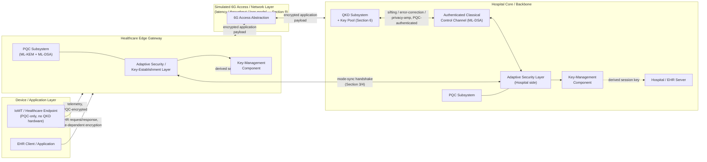

# TASK 6 — System Architecture, Threat Model, and Protocol Design

**Project:** Latency-Aware Adaptive QKD-PQC Key Establishment for
Electronic Health Record Sharing in 6G-Edge Healthcare Networks: A
Simulation-Based Evaluation Under Varying QKD Availability
**Authors:** Ramana Sree K V, Verona Ann Mariya
**Depends on:** Task 5 (approved, locked)
**Status:** Design specification only. Nothing implemented. No results
generated. No numerical parameters are finalized — every number that
appears below is either a structural placeholder explicitly marked
TBD-with-justification, or a range copied directly from a cited source
for plausibility/context, never invented and presented as final.

**Contribution framing (restated, so it isn't lost across a long
document):** the contribution is the **evaluation/characterization** of
adaptive QKD-PQC operation for EHR workloads under varying QKD
availability — not a new cryptographic protocol, not a new primitive,
and not a claim that combining QKD and PQC is itself novel (Task 5
explicitly ruled that out). Section 19.4 exists specifically to keep
this document itself honest about that boundary.

---

## Evidence basis and citation discipline for this document

This design draws on the literature integrated from Task 3/4/5
(`literature_matrix.csv`, `TASK03_04_synthesis.md`,
`TASK05_novelty_collision_analysis.md`, `TASK05_research_gap_and_blueprint.md`).
Two independent numbering schemes exist in that material — `P01–P20` in
`literature_matrix.csv` and `P1–P11` in the novelty collision analysis —
so this document cites by **author/year**, not by P-number, to avoid
conflating them.

Every design decision below grounded in a specific paper is labeled one
of:
- **ESTABLISHED** — the paper is fully or near-fully verified
  (Devaraj et al. 2026; Clason et al. 2026) and the cited finding is
  reported as an actual result, not a proposal.
- **DESIGN ASSUMPTION** — the paper is found and cross-checked via live
  search but not yet full-text-verified per the Task 3 checklist
  (Roosan et al. 2025; Papadopoulos et al. 2026; Spooren et al. 2026;
  Atutxa & Sanz et al. 2025; Zhu 2025), so the design decision resting on
  it is explicitly a **choice made pending confirmation**, not a
  literature-proven fact. These are collected in Section 19.1.
- **STANDARD TECHNIQUE** — a well-known systems/cryptography pattern
  (AEAD, HKDF, ephemeral keys for forward secrecy) that needs no
  paper-specific citation and is not claimed as a contribution.

---

## 1. System Model

### 1.1 Components

| # | Component | Role |
|---|---|---|
| 1 | **EHR Client / Application** | Initiates EHR transactions (read/write/share) on behalf of a clinician or patient-facing app. |
| 2 | **IoMT / Healthcare Endpoint** | A medical device (e.g., a vitals monitor) that contributes telemetry data into the EHR pathway. Always PQC-only — see 1.3 and Section 19.1 for why QKD hardware is not assumed at the device. |
| 3 | **6G Access / Network Layer** | A simulated wireless access abstraction (latency/throughput/loss model) connecting devices/clients to the Edge Gateway. Not a real 6G stack — see Section 9. |
| 4 | **Healthcare Edge Gateway** | Edge-compute node aggregating client/device traffic; hosts the Adaptive Security Layer, a PQC Subsystem, and a Key-Management Component. |
| 5 | **Adaptive Security / Key-Establishment Layer** | The decision logic (Section 4) selecting QKD-assisted-hybrid vs. PQC-only mode. Present at both the Edge Gateway and the Hospital Server (must agree — see mode-sync, Section 3). |
| 6 | **QKD Subsystem / Model** | Simulated quantum-channel abstraction producing symmetric key material into a bounded pool, at a modeled rate/availability (Section 6, Section 9). |
| 7 | **PQC Subsystem** | ML-KEM key encapsulation + ML-DSA signatures. Software-only; always available regardless of QKD state. |
| 8 | **Hospital / EHR Server** | Holds and serves the actual (synthetic, Section 10) EHR data; terminates the secure session; authenticates and decrypts. |
| 9 | **Key-Management Component** | Orchestrates the key lifecycle (Section 6) — generation, pooling, rotation, expiration, destruction — for both QKD- and PQC-derived material. Logically distinct from the Adaptive Security Layer even though co-located with it, per the instruction to list it separately. |

A tenth element — the **Authenticated Classical Control Channel** —
carries QKD sifting/error-correction/privacy-amplification traffic and
the PQC handshake. It is treated as a connection/interface (Section 1.2)
rather than a standalone component, since it doesn't hold state of its
own beyond what the QKD Subsystem and PQC Subsystem already manage.

### 1.2 Connections

For every connection: data transmitted / security mechanism / where key
establishment occurs / where encryption occurs / where authentication
occurs / where the adaptive decision occurs.

| Connection | Data | Security mechanism | Key establishment | Encryption | Authentication | Adaptive decision |
|---|---|---|---|---|---|---|
| IoMT Endpoint ↔ Edge Gateway | Telemetry/vitals | PQC-only (device has no QKD hardware — DESIGN ASSUMPTION, Section 19.1) | At Edge Gateway (ML-KEM) | At device before transmission (AEAD) | Device PQC cert (ML-DSA) → gateway | **Not** made at the device — device is always PQC-only by construction |
| EHR Client ↔ Edge Gateway | EHR request/response payload | Mode-dependent (Section 4) | At Edge Gateway | At sending endpoint (AEAD) | Mutual (client + gateway, ML-DSA) | **Made here** — this is the primary adaptive-decision point |
| Edge Gateway ↔ 6G Access Layer | Already-encrypted application payload | N/A — 6G layer is a transport abstraction, not a separate encryption domain (DESIGN ASSUMPTION, Section 19.1) | N/A | N/A (payload already encrypted end-to-end) | N/A | N/A |
| 6G Access Layer ↔ Hospital Core | Already-encrypted application payload | Same as above | N/A | N/A | N/A | N/A |
| Edge Gateway ↔ Hospital Server (backbone) | Encrypted EHR payload + mode-sync messages | Mode-dependent (Section 4); this is where the QKD channel physically/logically exists in our model (fixed backbone link, consistent with QKD's known distance/hardware constraints — Clason et al. 2026, ESTABLISHED) | Jointly, both ends (QKD pool draw + ML-KEM) | At sending endpoint | Mutual (ML-DSA) | Decision is **made** at Edge Gateway, **confirmed/mirrored** at Hospital Server via mode-sync |
| QKD Subsystem ↔ Authenticated Classical Channel | Sifting / error-correction / privacy-amplification protocol messages | ML-DSA-authenticated classical channel (DESIGN ASSUMPTION grounded in Atutxa & Sanz et al. 2025 — Section 19.1) | N/A (this channel authenticates QKD, it doesn't itself derive the session key) | N/A (control-plane, not the EHR payload) | ML-DSA | N/A |
| Key-Management Component ↔ {QKD Subsystem, PQC Subsystem} | Raw key material | Internal/in-memory only — not a network connection (trust-boundary discussion, Section 2) | N/A | N/A | N/A | N/A |

### 1.3 Architecture diagram



This is **Figure 1** — see Section 16 for full figure specifications.

---

## 2. Trust Boundaries

| Boundary | Trusted entity | Untrusted entity | Security assumption | Protected asset | Attack surface |
|---|---|---|---|---|---|
| IoMT device ↔ Edge Gateway | Edge Gateway (assumed within hospital-operated perimeter) | IoMT device (treated as semi-trusted; may be compromised — Threat D) | Device authenticates via a provisioned PQC credential; gateway does not blindly trust device-reported data integrity from network position alone | Telemetry data; device credential | Device firmware/credential compromise, physical tampering, malicious data injection under a valid credential |
| Edge Gateway ↔ 6G Network | Neither fully — the network is treated as untrusted transport by design | The 6G network itself | End-to-end application-layer encryption (Section 1.2) means confidentiality does not depend on 6G-layer security | Confidentiality/integrity of the encrypted payload | Passive eavesdropping (motivates harvest-now-decrypt-later, Threat A), active MITM if authentication were weak, traffic analysis (explicitly out of scope) |
| 6G Network ↔ Hospital Infrastructure | Hospital infrastructure (assumed operationally secured within its own perimeter) | Everything upstream of the hospital's network edge, including the 6G RAN/core | The hospital ingress point re-validates authentication before forwarding to the EHR Server — no implicit trust from arriving via the "hospital" path alone | Hospital-side key material; the EHR Server itself | Ingress-point compromise, malformed/replayed traffic |
| QKD Subsystem ↔ Classical Network | The authenticated classical channel is itself the trust anchor for QKD's security | An unauthenticated classical channel (would let a MITM defeat QKD regardless of its physical-layer security) | Classical-channel authentication uses ML-DSA, not classical PKI — DESIGN ASSUMPTION (Section 19.1), grounded in Atutxa & Sanz et al. (2025) | Integrity/authenticity of QKD sifting and key-confirmation messages | Classical-channel MITM, replay of stale sifting messages — this is Threat B (Section 7) |
| Hospital EHR Server ↔ Clients | EHR Server (root of trust for patient data) | All clients by default, including already-authenticated ones beyond their authorized scope | Every request authenticated per-session; no implicit trust from network position (zero-trust framing, loosely inspired by — not literally reused from — Devaraj et al. 2026's ZTA component) | EHR data at rest and in transit; patient identity/credential material | Credential theft/replay, compromised client endpoint (overlaps Threat D), authorization-logic flaws (explicitly out of scope — full access-control modeling was excluded in Task 2's scope and remains excluded here) |

---

## 3. Data Flow

The prompt's 10-step template is modified: an explicit **mode-sync
handshake** is inserted, because unlike a single-sided decision, both
communicating endpoints must consistently know which cryptographic mode
is active or decryption will fail. This is a protocol-design necessity,
not present in the generic template, and is called out here rather than
silently added.

### 3.1 Normal flow (QKD available)

1. EHR client (or IoMT endpoint) initiates a transaction (fetch record,
   push vitals, emergency access — Section 10).
2. Edge Gateway's Adaptive Security Layer checks whether an existing
   valid session key can be reused (Section 6's per-session validity
   window) or a new security context is needed.
3. If new: the Adaptive Layer queries current QKD availability (pool
   level + recent generation rate) from the Key-Management Component.
4. Adaptive decision (Section 4 policy): with QKD available above
   threshold, **MODE_HYBRID** is selected.
5. Key establishment: the QKD Subsystem supplies fresh key material from
   the pool; the PQC Subsystem concurrently performs ML-KEM encapsulation
   and ML-DSA-based mutual authentication (of both the classical QKD
   control channel and the application session); the session key is
   derived via `KDF(QKD_material || PQC_shared_secret || context_binding)`
   (Section 5).
6. **Mode-sync handshake**: Edge Gateway and Hospital Server confirm they
   derived matching session state and agree on the active mode.
7. EHR payload encrypted at the sending endpoint (AEAD, keyed by the
   derived session key).
8. Payload transmitted through the simulated 6G-edge network (Section 9).
9. Hospital EHR Server authenticates the sender (ML-DSA) and decrypts.
10. Acknowledgement/response returned along the same path, itself
    encrypted under the (possibly still-valid) session key.
11. Session state updated: key-usage counters incremented, QKD pool
    debited, rotation clock updated (Section 6), transaction mode and
    latency logged (feeds the Section 4 decision inputs and Section 14
    metrics).

### 3.2 Degraded-QKD flow (QKD available but below full capacity)

Steps 1–3 unchanged. At step 4, the decision logic (Section 4) evaluates
against a graduated policy rather than a binary split: for
non-emergency-criticality transactions, the Key-Management Component may
wait briefly (bounded, with a timeout — Section 4 Failure Handling) for
pool replenishment before deciding; emergency-flagged transactions never
wait (see Section 4). Steps 5–11 proceed as in the normal flow once a
mode is settled, and the transaction is logged as **degraded-mode** for
the fallback-frequency metric (Section 14).

### 3.3 QKD-unavailable flow (pool exhausted / channel down / below
minimum threshold)

1–3 as before. At step 4: **MODE_PQC_ONLY** selected immediately, no
wait. At step 5: key establishment via ML-KEM encapsulation only — no
QKD material contributes to the session key; ML-DSA authentication
proceeds as normal (it doesn't depend on QKD). Step 6's mode-sync
explicitly flags "PQC-only" so both ends derive the session key
identically. Steps 7–11 proceed as before, with the AEAD key being
PQC-only-derived and the transaction logged as a **fallback event**
(directly feeds Metric 6, Section 14).

### 3.4 Terminal failure (not a fourth flow, but a failure state of any of
the above)

If PQC establishment itself fails (e.g., a simulated timeout), the
transaction fails outright — it does **not** silently fall back to a
weaker or unencrypted mode. See Section 4 Failure Handling and Section 6.

---

## 4. Adaptive Mechanism

This is the central design component.

### Inputs
- **QKD key pool level** — current bits available, as a fraction of
  target pool capacity.
- **QKD key generation rate** — recent moving-average bits/sec (reflects
  channel quality/degradation).
- **Estimated key-establishment latency** for each candidate mode
  (QKD-assisted vs. PQC-only), from recent history.
- **Transaction criticality class** (routine vs. emergency — from the
  EHR workload model, Section 10). This is the deliberate,
  EHR-specific input that differentiates this policy from a bare
  transplant of Zhu (2025)'s power-grid mechanism, which has no
  criticality axis. It is the input most directly responsible for
  Hypothesis H2 (Task 5) and Contribution C3 (Task 5) being testable at
  all.

**Explicitly excluded inputs, with reasoning** (per "do not add
variables unless useful and measurable"):
- *Network congestion* — not included as a direct decision input because
  its effect is already captured indirectly via "estimated
  key-establishment latency"; adding it separately would double-count
  the same underlying signal.
- *Device constraints* — not a per-transaction decision input, because in
  this system model devices are *always* PQC-only by construction
  (Section 1.3) — device capability doesn't vary per transaction, so it
  isn't something the policy needs to check dynamically.

### Decision logic (pseudocode)

```
function select_mode(qkd_pool_level, qkd_gen_rate, criticality, thresholds):
    # thresholds = {pool_min_hybrid, pool_min_wait, wait_timeout}
    if qkd_pool_level >= thresholds.pool_min_hybrid:
        return MODE_HYBRID

    if criticality == EMERGENCY:
        # never wait for QKD on emergency-flagged transactions
        return MODE_PQC_ONLY

    if qkd_pool_level >= thresholds.pool_min_wait:
        wait_for_replenishment(up_to = thresholds.wait_timeout)
        if current_pool_level() >= thresholds.pool_min_hybrid:
            return MODE_HYBRID
        else:
            return MODE_PQC_ONLY

    # pool effectively exhausted
    return MODE_PQC_ONLY
```

### Output mode
`MODE_HYBRID` (QKD contributes to the session key alongside PQC) or
`MODE_PQC_ONLY` (PQC alone).

### Key establishment procedure (given the selected mode)
- **MODE_HYBRID**: draw N bits from the QKD pool (debiting it) + ML-KEM
  encapsulation → `session_key = KDF(QKD_bits || ML-KEM_secret ||
  context_binding)`. The classical control channel is ML-DSA-authenticated
  regardless of which mode is ultimately selected, since the control
  channel exists independent of the outcome (DESIGN ASSUMPTION, Section
  19.1).
- **MODE_PQC_ONLY**: ML-KEM encapsulation only →
  `session_key = KDF(ML-KEM_secret || context_binding)`. Authentication
  as above.

### Failure handling
- **QKD pool read fails / QKD Subsystem unresponsive** → treated as
  `qkd_pool_level = 0`, proceeding to `MODE_PQC_ONLY` — a fail-**safe**
  (toward the always-available mechanism), not fail-closed, choice. This
  is an explicit availability-over-strict-caution trade-off, and it is
  exactly the behavior Threat G (Section 7) targets — acknowledged here,
  not hidden.
- **PQC (ML-KEM) establishment fails** → the transaction fails; a
  bounded number of retries, then reported as a failure (feeds the
  "successful transmission rate" denominator, Metric 4). It does **not**
  silently fall back to an unencrypted or weaker-than-PQC mode — this is
  a hard requirement, not a tunable.
- **Mode mismatch at Hospital Server** (Edge Gateway and Hospital Server
  disagree on mode, e.g., due to message loss during mode-sync) →
  transaction **fails closed** — rejected outright, never decrypted with
  a guessed mode. Logged as a protocol-consistency failure; flagged again
  in Section 19.3 as a real implementation risk.

### Switching granularity: chosen and justified

**Per-session** switching is chosen — not per-transaction, not
per-time-window — where a "session" is the key-validity window defined
by the rotation policy in Section 6 (N transactions or T seconds,
whichever comes first).

- *Why not per-transaction*: it would maximize responsiveness to QKD
  availability changes, but re-running full key establishment on every
  single EHR read/write multiplies overhead and would make the measured
  latency/overhead numbers (Section 14) dominated by handshake cost
  rather than by the adaptive mechanism's actual behavior — directly
  undermining what this study is trying to measure.
- *Why not per-time-window*: plausible, but introduces an extra free
  parameter (window length) with no literature-grounded value to set it
  to. Per-session switching reuses the rotation policy Section 6 already
  needs, avoiding an extra undefended parameter.
- *Why a key pool matters here*: the decision logic reads the *pool's*
  current state rather than blocking on live QKD generation for each
  decision — the pool absorbs QKD's naturally bursty/rate-limited
  generation, which is precisely what makes per-session-granularity
  decisions tractable without constant re-negotiation.

This is a **systems-engineering trade-off**, not a research claim
requiring literature validation — flagged in Section 19.3 as a parameter
the eventual experiment matrix (Section 13) could sensitivity-test if
time allows, since it materially affects the metrics.

**Figure 2** (Section 16) visualizes this decision flow.

---

## 5. Cryptographic Design

No new cryptographic primitive is proposed anywhere in this section.

| Primitive | Purpose | Security role | Why suitable | Limitations |
|---|---|---|---|---|
| **ML-KEM** (formerly CRYSTALS-Kyber) | PQC key establishment (KEM) | Computational security under Module-LWE | NIST-standardized (FIPS 203, 2024); used across multiple sources in our literature base (Devaraj et al. 2026, ESTABLISHED; referenced for constrained IoMT in Maqsood et al. 2025; referenced in Papadopoulos et al. 2026's field pilot, DESIGN ASSUMPTION). **Not** claimed universally optimal — consistent with the explicit instruction and with Task 3/4's own finding that no source in our evidence base declares one PQC scheme best. | Larger ciphertext/key sizes than classical ECDH (a real, evidence-grounded overhead, ESTABLISHED per Devaraj et al. 2026); comparatively young hardness assumption relative to classical number-theoretic ones. |
| **ML-DSA** (formerly CRYSTALS-Dilithium) | PQC digital signatures — endpoint authentication, classical-channel authentication for QKD, mutual EHR client/server authentication | Computational security under Module-LWE/Module-SIS | NIST-standardized (FIPS 204); pairs naturally with ML-KEM; used directly in Devaraj et al. (2026)'s architecture. | Larger signatures than ECDSA; does not replace QKD's role — only authenticates the channels/parties around it. |
| **Conventional baseline (ECDH/ECDSA)** | Pre-quantum comparison point | Computational security under discrete-log/factoring assumptions, known-broken by a sufficiently capable quantum computer | Needed as Baseline B1 (Section 11) specifically *because* it lacks quantum resistance — that's the point of including it. | Not part of the proposed architecture; included only as a comparison baseline. |
| **QKD-generated symmetric key material** | Contributes information-theoretic-security-flavored entropy to the hybrid session key when available | Information-theoretic, under standard QKD assumptions (no-cloning, authenticated classical channel) | Modeled at rate/availability parameters informed by Clason et al. (2026)'s 303 km field-deployed trusted-node link (ESTABLISHED as a real result, used here only for plausibility/context, not copied as our literal topology). | Entirely simulated in this project — no physical QKD hardware (Section 17). The model's fidelity to real QKD physical-layer behavior is bounded by whatever parameter ranges the still-outstanding literature fetch (Section 19.1) can support. |
| **Authenticated classical control channel** | Carries QKD sifting/error-correction/privacy-amplification and PQC handshake messages, authenticated via ML-DSA rather than classical PKI | Prevents Threat B (classical-channel MITM defeating QKD) | Grounded in Atutxa & Sanz et al. (2025)'s finding that QKD's classical channel needs authentication independent of QKD itself — **DESIGN ASSUMPTION**, not yet full-text re-verified (Section 19.1). | If the underlying finding doesn't hold up on full-text review, this specific design choice needs revisiting — flagged, not silently relied upon. |

### Hybrid key derivation — precisely specified

```
session_key = KDF( QKD_key_material || PQC_shared_secret || context_binding )
```

`context_binding` includes a session/transaction identifier and the
negotiated mode label, cryptographically binding the derived key to the
specific mode agreed during the mode-sync handshake (Section 3.1 step 6)
— this prevents a class of downgrade confusion where a key derived for
one mode could be misinterpreted as belonging to another. `KDF` is a
standard construction (e.g., HKDF) — a well-known building block, **not**
a novel contribution of this project (see Section 19.4).

**Explicit non-claim:** combining QKD-derived and PQC-derived key
material via a KDF is **not claimed here to automatically produce
stronger security than either alone**. The intended property (the
session key remains secure if at least one of the two inputs remains
unbroken) is a known, standard "hybrid combiner" property discussed in
general (non-healthcare) hybrid key-exchange literature. Whether this
specific KDF construction correctly achieves that property is a
**DESIGN ASSUMPTION resting on general hybrid-combiner literature, not
independently proven within this project** — a formal proof is out of
scope (carried forward from Task 2's Section 6 scope exclusions).

---

## 6. Key Management

### Lifecycle

- **Generation**: QKD material generated continuously into the pool
  (Section 1's QKD Subsystem model); PQC key pairs generated per-endpoint
  at provisioning time (long-term identity keys, ML-DSA) and per-session
  (ephemeral ML-KEM keys, for forward secrecy — STANDARD TECHNIQUE, not a
  research claim).
- **Establishment**: per Sections 3–5 (mode-dependent).
- **Storage**: session keys held in memory only, for the session's
  lifetime (no persistent storage — a simplification appropriate for a
  simulation study, not modeled at secure-enclave/HSM granularity;
  explicit scope boundary, Section 17). The QKD pool itself is the one
  persistent(ish) store, modeled as a bounded buffer.
- **Use**: session key used for AEAD encryption of transaction payload(s)
  within its validity window (Section 4's per-session granularity).
- **Rotation**: at the earlier of N transactions or T seconds. **N and T
  are not invented here** — they are recorded as TBD-with-justification
  parameters to be set during implementation against a literature-sourced
  or explicitly-labeled-illustrative default (Section 19.1/13), not
  guessed now.
- **Expiration**: expired keys are destroyed (zeroized in a real
  implementation; "no longer referenced" in simulation) and unusable for
  new transactions. An in-flight transaction using an expiring key is
  allowed to complete rather than being forcibly interrupted —
  DESIGN ASSUMPTION, a deliberate availability/usability trade-off.
- **Destruction**: on expiration, explicit session teardown, or detected
  mode-mismatch failure (Section 4).
- **Fallback**: not a separate lifecycle stage — it is a specific
  establishment path already covered by Section 4.
- **Recovery**: once a QKD outage ends and the pool refills above
  threshold, only the **next new session** (not existing PQC-only
  sessions mid-flight) is eligible for `MODE_HYBRID` again — recovery is
  evaluated at session boundaries, consistent with per-session
  granularity, not retroactively upgraded mid-session.

### QKD key pool model

```
QKD generation --> [ Key Pool: bounded buffer, level L, capacity C ]
                              |
                    availability check: L / C vs. thresholds
                              |
              --------------------------------------
              |                                     |
     L/C >= pool_min_hybrid               L/C < pool_min_hybrid
              |                                     |
     MODE_HYBRID (debit pool               MODE_PQC_ONLY
     by N bits per session)                (pool untouched)
```

**What happens when:**
- *QKD key material sufficient* → `MODE_HYBRID`, pool debited.
- *QKD key material insufficient* → per Section 4's wait/no-wait logic.
- *QKD link fails* (modeled as generation rate → 0) → pool drains toward
  0 as sessions debit it without replenishment; system transitions to
  `MODE_PQC_ONLY` as the pool crosses threshold. **This graceful
  degradation is the central phenomenon Hypothesis H1 (Task 5) is
  designed to measure — it must be demonstrated by the running
  simulation, not assumed to occur correctly by construction.**
- *PQC establishment fails* → per Section 4 (bounded retry, then
  failure — no silent downgrade).
- *Network connection interrupted mid-transaction* → transaction marked
  failed/incomplete (feeds Metric 4's denominator); the session key is
  **not** reused for a retry without re-running mode selection — a
  conservative choice against replaying a possibly-compromised-by-
  interruption key.

---

## 7. Threat Model

| # | Threat | Attacker capability | Target | Expected impact | Mitigated? | Out of scope |
|---|---|---|---|---|---|---|
| A | Quantum-capable passive adversary | A future cryptographically-relevant quantum computer (Shor's-class), and/or unlimited storage to harvest ciphertext now | Confidentiality of EHR payloads and classical-crypto key exchange (Baseline B1) | Full retroactive decryption of harvested classical-crypto traffic, if/when such a computer exists | **YES** for `MODE_HYBRID`/`MODE_PQC_ONLY` (neither depends on breakable classical asymmetric crypto). **NO** for Baseline B1 — that is B1's entire purpose (Section 11). | Whether/when such a computer actually exists — a threat-model assumption, not a present-day capability claim (Task 2). |
| B | Classical MITM on the classical/authentication channel, including QKD's control channel | Active network position; can intercept/modify/inject on the classical channel | The authenticated classical channel (Section 1.2/5) | Could defeat QKD's guarantee entirely if the channel is unauthenticated, or hijack the PQC handshake | **YES by design** — ML-DSA authentication (Section 5) addresses this. **This mitigation itself rests on the DESIGN ASSUMPTION in Section 19.1** (Atutxa & Sanz et al. 2025, not yet fully re-verified). | Attacks on the ML-DSA implementation itself (side-channel, bugs) — accepted external risk (Task 2 scope). |
| C | Network eavesdropper (passive, classical-capability only — distinct from A) | Passive interception of the 6G-edge transport link, no quantum capability | Confidentiality of encrypted payloads in transit | None, under standard AEAD-confidentiality assumptions | **YES** (STANDARD TECHNIQUE — AEAD confidentiality, not a novel claim) | Traffic analysis / metadata leakage (timing, payload size revealing transaction type) — explicit scope exclusion. |
| D | Compromised IoMT endpoint | Full control of one device (firmware compromise, extracted credential) | Data reported by that device; its own PQC credential | False telemetry injected under a validly-authenticated identity | **PARTIALLY** — cryptographic authentication does **not** stop a legitimately-credentialed-but-compromised device from lying. Stated plainly, not implied away. | Device-level attestation/integrity monitoring, intrusion detection (Task 2 scope). |
| E | QKD channel outage (fault, not necessarily adversarial) | Fiber cut, equipment failure, adverse channel conditions | Availability of the QKD contribution to key establishment | Without mitigation, QKD-dependent transactions could stall/fail | **YES** — this is the mechanism under study (Section 4). But "mitigated" means "gracefully degrades to PQC-only," **not** "QKD's specific security property is preserved" — the guarantee's character changes (from including information-theoretic contribution to purely computational) on fallback, and this distinction must survive into the eventual paper's Security Analysis, not be glossed over. | Physical repair/restoration of real QKD infrastructure — not modeled; only the pool/availability-signal abstraction is (Section 1). |
| F | QKD resource exhaustion (pool depleted faster than replenished — channel fine, demand outstrips supply) | Organic (legitimate high load, Section 13's scaling axis) or adversarial (deliberate key-material-exhausting DoS) | QKD key pool availability | Forces `MODE_PQC_ONLY` even though the channel itself is fine | **PARTIALLY** — the fallback handles the resulting condition gracefully (same path as E), but the architecture does **not** distinguish organic exhaustion from adversarial exhaustion. An attacker generating enough fake demand could force fallback at will. Named as a limitation, not hidden. | Rate-limiting/anti-DoS logic at the transaction-admission layer — not designed here; candidate future work. |
| G | Downgrade/fallback manipulation | Active network position able to interfere with the availability signal or the mode-sync handshake specifically (e.g., spoofing "QKD unavailable") | The adaptive decision logic itself | Forced downgrade to the computational-only mode without breaking any cryptography directly | **PARTIALLY** — the mode-sync handshake is ML-DSA-authenticated, preventing *forgery* of a mode-sync message. It does **not** prevent an attacker from causing *genuine* QKD unavailability (Threat E/F), which correctly and honestly triggers the same fallback. The architecture defends the **integrity of the mode announcement**, not the underlying resource the decision depends on — a narrower claim than "outage-proof," and must not be blurred in the eventual paper. | Fully solving resource-exhaustion-based coercion (Threat F) — a named limitation, not solved here. |

---

## 8. Security Objectives

**Security properties** (what the architecture guarantees):
- **Confidentiality** — EHR payload content is not recoverable without
  the session key, under Section 7's threat model, in both operating
  modes.
- **Integrity** — EHR payload is not undetectably modified in transit
  (AEAD authentication tag).
- **Authentication** — all parties are cryptographically authenticated
  (ML-DSA) before a session key is trusted/used.
- **Quantum resistance** — confidentiality/authentication do not depend
  on classical hardness assumptions known to be broken by a sufficiently
  capable quantum computer. Applies to `MODE_HYBRID`/`MODE_PQC_ONLY`;
  explicitly **not** claimed for Baseline B1, by design.
- **Availability/resilience** — the system continues providing *some*
  quantum-resistant secure mode across the full range of modeled QKD
  availability, rather than failing closed when QKD alone degrades.
- **Secure fallback** — the mode transition does not itself create a
  window of reduced authentication or an undetected downgrade, beyond
  what's explicitly acknowledged in Threat G.

**Performance properties** (measured, not guaranteed — mirrors the
prompt's own confidentiality-vs-latency example and extends it
consistently):
- Latency (key-establishment and end-to-end)
- Communication overhead
- Throughput
- **Successful-transmission rate** — classified here explicitly as a
  performance/resilience *metric*, not a security *property*: "the
  system still worked" is a different claim from "the system was
  confidential/authentic," and conflating them would be imprecise.
- Fallback frequency
- Scalability
- CPU/memory cost

---

## 9. 6G-Edge Model

**6G-RELEVANT SIMULATION ASSUMPTIONS** (explicitly not claimed to
reproduce real 6G):

1. **Dense healthcare device population** — the simulation models more
   concurrently-connected IoMT/client devices per edge gateway than
   typical current deployments, reflecting 6G's anticipated
   massive-connectivity characteristic. *Why it matters*: this is the
   load axis Section 13's device/user-count sweep directly measures —
   without an assumed density target, the scalability experiment has no
   anchor.
2. **Low-latency access link** — the simulated access link is modeled
   with a lower baseline latency budget than typical 4G/5G, reflecting
   6G's anticipated ultra-low-latency target. *Why it matters*: this sets
   the "budget" against which key-establishment/session overhead (a
   real, measured cost per Section 5) is evaluated — if the access
   link's own latency dominated, the adaptive mechanism's effect would
   be masked.
3. **Variable network load** — the simulated link supports a
   configurable load/congestion parameter (Section 12). *Why it
   matters*: a real 6G-edge deployment experiences variable conditions,
   not an idealized constant channel.
4. **Edge-native processing** — cryptographic/adaptive-decision
   processing happens *at* the Edge Gateway, not solely centralized at
   the hospital core, reflecting 6G's anticipated edge-integrated
   architecture. *Why it matters*: this is precisely why an Edge Gateway
   component exists in Section 1 at all, rather than a simpler
   client-to-server model — it's the structural feature making this a
   6G-*edge* study rather than a generic client-server security study.
5. **Multiple healthcare sites (optional/scalability extension)** — the
   topology *may* extend to multiple edge gateways/hospital sites,
   reflecting a realistic regional network. Flagged **optional**,
   contingent on time, consistent with Task 2's feasibility assessment
   already flagging large topologies as something to keep tractable.

**Explicitly not modeled or claimed**: real 6G PHY/MAC-layer protocols
(none is finalized — Task 2's problem statement); 6G network slicing;
AI-native network functions; anything not directly load-bearing to the
experiment (Section 12) is excluded to avoid scope creep and to avoid
implying a standardization claim that doesn't exist.

---

## 10. EHR Workload Model

Synthetic data only — **no real patient data**. Structure loosely
inspired by FHIR resource shapes for realism, without claiming
FHIR-standard conformance as a contribution (that would be a distraction
from the actual research question).

**Size classes:**
- **Small record** — e.g., a single vitals/observation update or brief
  clinical note. Small payload, high frequency, LOW criticality
  (routine) by default.
- **Medium clinical record** — e.g., a visit summary or structured
  problem/medication list. Moderate payload, moderate frequency, MIXED
  criticality.
- **Large composite record** — e.g., a multi-document bundle (history +
  labs + imaging references). Large payload, low frequency, MIXED
  criticality.

**Criticality is a separate axis, not a fourth size class**: an
**emergency-access** flag can apply to a transaction of any size class.
This is the axis the adaptive policy (Section 4) actually consumes, and
the one Hypothesis H2 (Task 5) is built around.

For each class, the *structure* is defined here; final numeric values
(payload bytes, request frequency) are **TBD-with-justification**,
informed by representative FHIR resource examples where a source can be
found during implementation, or explicitly labeled an illustrative
assumption if not — consistent with "do not invent numerical parameters
without justification."

**Transaction types**: read (fetch record), write (push update/vitals),
**share** (inter-site/inter-provider exchange). *Share* is the type most
literally matching the paper's "EHR sharing" framing and should be the
most heavily represented/analyzed type, not treated as merely one of
three equally-weighted types.

**Generation method**: procedurally generated synthetic records,
optionally seeded from open synthetic-data tooling (e.g., a
Synthea-style generator, consistent with the team's existing plan per
Task 5's blueprint) — explicitly not a real dataset, avoiding any
patient-privacy/ethics overhead (Task 2 scope). A real public dataset is
judged **unnecessary**: the experiment needs controlled, repeatable
payload characteristics to isolate the adaptive mechanism's effect,
which synthetic generation provides directly and a real dataset's
uncontrolled variability would confound.

---

## 11. Baselines

| | B1 — Classical | B2 — PQC-only | B3 — QKD-only | B4 — Static hybrid | B5 — Adaptive (proposed) |
|---|---|---|---|---|---|
| **Key establishment** | ECDH (e.g., X25519) | ML-KEM | QKD material only | Both QKD and ML-KEM, always | Section 4's policy (QKD+ML-KEM or ML-KEM only, mode-dependent) |
| **Encryption** | AEAD keyed from ECDH secret | AEAD keyed from ML-KEM secret | AEAD keyed from QKD material | AEAD keyed from combined secret (Section 5's KDF) | AEAD keyed from mode-dependent derived key |
| **Authentication** | ECDSA (or RSA — implementation detail, undecided here) | ML-DSA | **Open design question** — flagged below | ML-DSA | ML-DSA |
| **QKD dependency** | None | None | Total | Required every session | Adaptive — required only in `MODE_HYBRID` |
| **Failure behavior** | N/A (no adaptivity) | N/A — always available by construction (software-only) | Blocks/fails when QKD unavailable — this **is** the unmitigated-outage comparison point | **Flagged open question** below | Falls back to `MODE_PQC_ONLY` (Section 4) |
| **Purpose in experiment** | Pre-quantum reference point; expected fastest/lowest-overhead, setting the performance ceiling | Represents the fallback mode's own ceiling; establishes PQC-only cost independent of QKD interaction | Best-case confidentiality profile under full availability; worst-case resilience profile under degraded availability (Hypothesis H1's two-sided comparison) | Isolates the effect of **adaptivity** specifically (B4 vs. B5, holding "attempts both when possible" constant) | The system under study — every other baseline exists to make B5's results interpretable |

**Two open design questions, deliberately not silently resolved:**
- **B3's authentication**: if B3's classical control channel is left
  unauthenticated, B3 becomes unrealistically insecure; if it uses
  ML-DSA (matching the proposed system), B3 quietly imports a PQC
  dependency that muddies the "QKD-only" label. **This must be resolved
  explicitly at implementation time** (most likely: yes, authenticate it
  with ML-DSA, and state clearly in the eventual paper that "QKD-only"
  refers to the *session-key material*, not the full authentication
  stack) — not silently decided either way.
- **B4's failure behavior**: for B4 to remain a meaningful,
  *adaptivity-isolating* comparison against B5, it should **block/fail**
  when QKD is unavailable rather than defining its own undefined
  fallback — a silent fallback would make B4 behaviorally indistinguishable
  from B5 under outage, defeating its purpose as a baseline. Stated here
  explicitly so it isn't decided differently, and inconsistently, during
  implementation.

**Fairness commitment**: all five baselines use the *same* AEAD
construction, the *same* simulated network/topology conditions, and the
*same* EHR workload generator (Section 10) within any given experimental
run (Section 12's control variables) — only the key-establishment/
mode-selection logic differs. This is the single most important
methodological commitment for the eventual Results section to be
defensible, and is restated here for emphasis.

---

## 12. Experimental Variables

**Independent variables** (each with its inclusion justified):
- **QKD availability** — the primary variable; directly named in the
  locked research question (Task 5).
- **Device/user count** — the scalability axis (also named in the RQ).
- **EHR payload size** — tests whether overhead findings depend on
  payload size, not merely on QKD's presence/absence.
- **Network load** — tests whether latency findings generalize beyond an
  idealized, uncongested network; gives Section 9's "variable network
  load" assumption an actual experimental lever, rather than leaving it
  asserted but untested.

**Dependent variables** (defined precisely in Section 14): key-
establishment latency, end-to-end EHR transmission latency,
communication overhead, successful-transmission rate, throughput,
fallback frequency, and — **conditionally**, if the chosen simulation
framework supports the instrumentation without disproportionate effort
— CPU/memory cost.

**Control variables** (held fixed within a given comparison, to isolate
the effect under study):
- Cryptographic algorithm choice (one primary ML-KEM/ML-DSA parameter
  set, per Section 5, unless a dedicated algorithm-comparison
  sub-experiment is explicitly added later — not committed to here).
- Network topology (fixed Edge-Gateway/Hospital-Server structure per
  Section 1, varied only via the independent variables above).
- EHR workload generator/distribution (Section 10's generation method
  fixed; only size-class mix and criticality-flag rate vary as
  independent-variable-adjacent settings, not the generator's underlying
  randomness model).
- Simulation duration/warm-up period (fixed per experiment, so
  time-dependent dynamics like pool-depletion and fallback-frequency are
  compared on equal footing across runs).
- Hardware/software environment (held constant within a comparison batch
  and recorded per Section 18, since PQC operation timings specifically
  are hardware-sensitive).

---

## 13. Experiment Matrix

The prompt's example dimensions (5 × 5 × 3 × 3 = 225 cells) are **not**
automatically adopted — instructions explicitly warn against this, and
Task 2's feasibility assessment already flagged that a full,
un-reduced cross-product risks being computationally unrealistic for a
2–3-month, two-student project.

**Proposed reduced design** (structure, not locked final numbers):

| Axis | Levels | Rationale for resolution chosen |
|---|---|---|
| QKD availability | 5: {100%, 75%, 50%, 25%, 0%} — kept at full example resolution | The *primary* independent variable (named directly in the RQ); the one axis needing fine resolution to characterize graceful degradation (Hypothesis H1). Resisted reducing this one. |
| Device/user count | 3: {10, 100, 1000} | Reduced from the example's 5. Spans ~2 orders of magnitude — enough to detect a scalability trend (Hypothesis H3) without paying for intermediate points a feasibility-constrained study can defer. |
| Payload size | 3: {small, medium, large} — matches Section 10 | Not an arbitrary sweep — maps directly onto the EHR workload model already defined. |
| Network load | 2: {nominal, congested} | Reduced from the example's 3. A secondary/control-adjacent variable (Section 12), not a primary research axis — binary nominal-vs-degraded is sufficient to check robustness without tripling the matrix. |
| Criticality mix | **Not a separate matrix dimension** | Every run includes a fixed, realistic mix of routine/emergency-flagged transactions; criticality is analyzed as a *within-run breakdown* of latency (Metric 2), keeping Hypothesis H2 testable without multiplying matrix size. |

**Resulting size**: 5 × 3 × 3 × 2 = **90 cells per baseline** × 5
baselines = **450 total configured runs**. This is explicitly flagged as
a candidate for further reduction (e.g., running the device-count sweep
only at the "medium payload / nominal load" cell, rather than the full
cross) if implementation-time performance testing shows 450 runs ×
repetitions is impractical within the timeline — this reduction decision
is **deferred to implementation**, not locked here.

**Repetitions**: each cell run multiple times with different seeds
(Section 18) to characterize variance, not just report a point estimate.
The exact count (e.g., 10/20/30 runs per cell) is set from a **pilot
run's observed variance**, not guessed in advance — documented as
TBD-with-justification, consistent with the instruction not to invent
numerical parameters without justification.

---

## 14. Metrics

Each metric defined by numerator / denominator / measurement point /
unit / aggregation.

1. **Key-establishment latency**
   - Numerator: (timestamp session key fully derived and mode-sync
     confirmed) − (timestamp establishment initiated)
   - Denominator: N/A
   - Measurement point: Edge Gateway (initiating side)
   - Unit: milliseconds
   - Aggregation: mean, median, 95th percentile (mean alone hides tail
     latency, which matters for the emergency-access comparison, H2)

2. **End-to-end EHR transmission latency**
   - Numerator: (ack received at EHR client) − (transaction initiated,
     Section 3.1 step 1)
   - Denominator: N/A
   - Measurement point: EHR client/application
   - Unit: milliseconds
   - Aggregation: mean/median/95th percentile, reported **separately**
     for routine vs. emergency-flagged transactions (H2's direct test)

3. **Communication overhead**
   - Numerator: total bytes transmitted per transaction, **including**
     key-establishment/handshake/authentication messages
   - Denominator: bytes of the underlying EHR payload alone (reported as
     a ratio) — **and** reported as an absolute byte count separately,
     since the ratio is more comparable across payload classes and the
     absolute count is more directly actionable
   - Measurement point: summed across the full transaction path
   - Unit: bytes (absolute) and a dimensionless ratio (relative)
   - Aggregation: mean per transaction, broken out per baseline and
     payload class

4. **Successful-transmission rate**
   - Numerator: count of transactions completing successfully (per
     Section 6/4's failure-handling definitions)
   - Denominator: total transactions attempted, in that cell
   - Measurement point: end of transaction lifecycle (Section 3.1, steps
     10–11)
   - Unit: percentage
   - Aggregation: computed **per cell**, not globally averaged —
     averaging across very different conditions would obscure exactly
     the graceful-degradation pattern the study exists to reveal

5. **Throughput**
   - Numerator: count of successfully completed transactions
   - Denominator: simulated wall-clock time of the measurement window
   - Measurement point: system-wide, per cell
   - Unit: transactions/second
   - Aggregation: per cell, breakable down per baseline

6. **Fallback frequency**
   - Numerator: sessions using `MODE_PQC_ONLY` as a fallback (only
     meaningful for B5, and possibly B4 depending on how Section 11's
     open question resolves)
   - Denominator: total sessions established in the cell
   - Measurement point: at session establishment (Section 4's decision
     output)
   - Unit: percentage
   - Aggregation: per cell, primarily analyzed against the
     QKD-availability axis — the most direct empirical test of whether
     Section 4's logic behaves as designed

7. **Scalability**
   - Not an independently-measured quantity — the **trend** of latency,
     successful-transmission rate, and throughput **as a function of**
     device/user count, reported as a degradation curve, not a single
     number.
   - Measurement point/unit/aggregation: inherited from the underlying
     metric being viewed across the device-count axis.

8. **CPU/memory cost** (conditional, per Section 12)
   - Numerator: measured CPU-time / peak memory consumed by the
     cryptographic operations specifically (key generation,
     encapsulation/decapsulation, signing/verification) — **not** the
     whole simulation process, which would conflate simulator overhead
     with the thing actually being studied.
   - Denominator: N/A (or per-operation, if reported as a rate)
   - Measurement point: instrumented around the PQC/QKD-model library
     calls — requires deliberate implementation effort, not automatic.
   - Unit: milliseconds (CPU time), megabytes (memory)
   - Aggregation: mean per operation type, per baseline

---

## 15. Expected Trade-offs (hypotheses, not results)

- Higher QKD availability may reduce reliance on `MODE_PQC_ONLY` (lower
  fallback frequency, Metric 6), but QKD's contribution may itself add
  key-establishment latency relative to PQC-only, since QKD's practical
  key-generation rate is expected — based on field-deployment evidence
  (Clason et al. 2026) — to be a binding constraint relative to a purely
  computational PQC operation.
- Adaptive fallback (B5) is expected to improve successful-transmission
  rate (Metric 4) relative to QKD-only (B3), and possibly static hybrid
  (B4), specifically under degraded/low QKD availability — at some cost
  in decision-logic/mode-sync overhead relative to B4's simpler
  always-both approach *when QKD is available*. B5 is **not** expected
  to strictly dominate B4 in every condition — only to be more resilient
  under degradation (Hypothesis H1, Task 5).
- The latency/overhead cost of mode-sync and adaptive decision logic,
  over and above B2's PQC-only cost, is expected to stay small relative
  to end-to-end latency for **routine** transactions, but may become
  proportionally more significant for **emergency**-flagged transactions
  with tighter budgets — the specific, EHR-differentiating trade-off
  this study exists to surface (Hypothesis H2), **not assumed to resolve
  in either direction in advance**.
- Fallback frequency (Metric 6) is expected to increase both as QKD
  availability decreases *and* as device/user count increases (more
  concurrent sessions drain the pool faster) — a compounding effect
  between two independent variables the matrix (Section 13) is
  structured to detect, since both axes are swept, not just one.
- Communication overhead (Metric 3) is expected to be highest for B4
  (always both mechanisms) and B3 (QKD-only, but with the added
  classical-channel-authentication overhead per Section 11's flag), and
  lowest for B2/B1 — with B5 expected to track close to B2 under low QKD
  availability and closer to B4 under high availability, essentially by
  construction of the adaptive policy. This last expectation is close to
  definitional given the design, not a risky prediction, and is
  presented as such rather than oversold as a "finding."

None of the above are results. All are testable expectations the
eventual experiment is designed to confirm, contradict, or refine.

---

## 16. Architecture Figures

**Figure 1 — Overall system architecture.** The Section 1.3 Mermaid
diagram: 9 components, grouped by layer (device / 6G access / edge
gateway / hospital core), with connection arrows labeled by data type
and security mechanism (abbreviated). Purpose: orient the reader before
any protocol detail — this is the paper's System Model figure.

**Figure 2 — Adaptive QKD-PQC decision flow.** A flowchart of Section 4's
decision-logic pseudocode: QKD pool-level check → criticality-dependent
wait/no-wait branch → `MODE_HYBRID`/`MODE_PQC_ONLY` output → key
establishment procedure box → failure-handling branches (QKD read
failure, PQC establishment failure, mode mismatch). Purpose: this is the
paper's central mechanism; the figure should stand alone as "here is
exactly how the adaptive policy decides."

**Figure 3 — EHR transaction / key-establishment sequence.** A sequence
diagram (lifelines: EHR Client/IoMT, Edge Gateway, Hospital Server, QKD
Subsystem, PQC Subsystem) covering the 11-step flow from Section 3, in
three variants (normal / degraded / unavailable) — shown as three panels
or one annotated diagram with branch points; exact layout deferred to
figure-production time. Purpose: makes the *temporal*/protocol behavior
concrete, especially the mode-sync handshake and where
encryption/authentication/key-establishment/the adaptive decision each
occur.

**Figure 4 — Experimental topology and baseline comparison.** Two parts:
(a) the simulated experimental topology (Edge Gateway(s), Hospital
Server, device population, optionally multiple sites per Section 9),
annotated with the independent-variable injection points (QKD
availability, device-count scaling, network load); (b) a compact
table/legend summarizing B1–B5 side by side on the Section 11 dimensions
(key establishment / QKD dependency / failure behavior), so a reader can
cross-reference baselines without flipping back to text. Purpose:
anchors the eventual Experimental Setup section; makes the comparison
structure visually obvious.

---

## 17. Implementation Boundary

**WILL IMPLEMENT** (real code, this project):
- The adaptive decision logic (Section 4).
- The key-management/pool model (Section 6).
- Real PQC operations via a real library (liboqs bindings — already in
  `requirements.txt`), so latency/overhead/CPU numbers (Metrics 1, 3, 8)
  are genuine measurements, not modeled estimates.
- Real AEAD encryption/decryption of synthetic EHR payloads (Section 10)
  via a real crypto library.
- The simulation harness itself (topology, event scheduling, workload
  generation, baseline orchestration, metrics collection/logging).

**WILL SIMULATE** (modeled behavior, executed as running code producing
real output data, but not physically real):
- The QKD Subsystem's key-generation process (rate, pool dynamics,
  outage injection) — a parameterized model (Sections 1/6), not a real
  quantum channel.
- The 6G access/network layer (Section 9) — simulated latency/
  throughput/loss/congestion, not a real radio network.
- The overall topology and multi-device/multi-site scaling (Sections
  12/13) — simulated, not deployed.

**WILL MODEL ABSTRACTLY** (parameters/assumptions, not simulated in
fine-grained detail):
- QKD physical-layer behavior (photon transmission, detector noise,
  error-correction/privacy-amplification internals) — abstracted to a
  rate/availability parameter informed by literature-reported figures
  (Clason et al. 2026), not simulated at the physical layer.
- 6G radio-layer protocol behavior (PHY/MAC) — abstracted to
  latency/throughput parameters, not modeled as an actual protocol
  stack.
- Hospital/EHR-server application logic beyond the security layer
  (clinical workflows, access-control policy) — out of scope per Task 2
  and Section 2 here, so not modeled even abstractly beyond "the server
  exists and authenticates/decrypts."

**WILL NOT IMPLEMENT**:
- Physical QKD hardware.
- Quantum computers.
- Real hospital infrastructure or real patient data.
- A production-grade, hardened key-management system (Section 6 is
  scoped to what the experiment needs, not a deployable KMS).
- Novel cryptographic primitives (restated from Task 2's scope and this
  task's instruction not to claim cryptographic novelty).

**Tool recommendation** (arrived at *after* the above, not before):
- **Python** — matches `requirements.txt` and the team's existing
  tooling plan.
- **SimPy** (already in `requirements.txt`) — discrete-event simulation
  harness (topology, event scheduling, concurrent-session handling); a
  standard fit for this class of problem, not a novel infrastructure
  choice.
- **NetworkX** — only if the multi-site extension (Section 9, optional)
  is pursued; flagged conditional otherwise.
- **NumPy/Pandas** — metrics aggregation, statistical summarization
  (Section 14), results storage.
- **liboqs** (via `liboqs-python`, already in `requirements.txt`) — real
  ML-KEM/ML-DSA operations.
- **A real crypto library** (e.g., `pycryptodome`, already in
  `requirements.txt`, or Python's standard `cryptography` package) — for
  AEAD and the classical (B1) baseline. Specific package is an
  implementation detail, not decided here.
- **Qiskit / Qiskit Aer** — **only** if the QKD Subsystem is implemented
  as an actual BB84-style protocol simulation rather than a pure
  rate/availability parameter model. This is a genuinely open trade-off:
  a parameterized-rate model may be sufficient for a study about
  *adaptive behavior under varying availability* (the actual research
  question), whereas a full protocol simulation adds fidelity at real
  complexity/runtime cost that may not be justified. This trade-off
  should be made explicitly and briefly justified in writing at
  implementation time, not defaulted into silently.
- **Containerized services**: not currently seen as necessary — a
  single-process discrete-event simulation is likely sufficient at this
  study's scale (Section 13). Revisit only if the multi-site extension
  specifically requires distributed execution.

**Nothing has been installed.** This is a recommendation for the
eventual implementation task, consistent with the instruction not to
implement yet.

---

## 18. Reproducibility Plan

- **Configuration files**: each experiment cell (Section 13) defined by
  a versioned config (YAML, given `pyyaml` is already in
  `requirements.txt`) specifying baseline, QKD-availability level,
  device count, payload-class mix, network-load level, and the fixed
  control-variable values (Section 12) — stored in `experiments/configs/`.
- **Random seeds**: every run assigned an explicit, logged seed (not
  system entropy), so any run is exactly replayable; repetitions
  (Section 13) use a documented seed sequence, not ad hoc randomness.
- **Experiment parameters**: every numeric parameter left
  TBD-with-justification above (rotation window N/T, pool capacity,
  matrix repetition count, payload byte ranges, etc.) will be recorded,
  once finalized, in a single canonical parameters file/table with a
  one-line justification each (literature-sourced, or explicitly labeled
  "illustrative assumption" per Task 2's scope discipline) — not
  scattered across code.
- **Logging**: structured, per-transaction event logs (timestamps for
  every Section 3 step, mode selected, success/failure outcome),
  sufficient to recompute every Section 14 metric after the fact from
  raw logs, not only from pre-aggregated summaries — so metric
  definitions can be revisited without re-running the simulation.
- **Result storage**: raw per-run logs and aggregated per-cell summaries
  stored separately in `experiments/results/`, following the existing
  repo convention, with a clear raw-vs-aggregated distinction.
- **Experiment naming**: a consistent scheme, e.g.
  `baseline={B1..B5}_qkd={0,25,50,75,100}_devices={10,100,1000}_payload={small,medium,large}_load={nominal,congested}_seed={n}`,
  so any result file's provenance is recoverable from its filename
  alone.
- **Environment capture**: Python version, exact package versions
  (`requirements.txt`), and relevant hardware/CPU info recorded once per
  experiment batch, since PQC timings are hardware-sensitive (Section
  12) and cross-machine comparison without this record would be
  methodologically unsound.
- **Plotting**: results figures generated programmatically from stored
  aggregated results (not hand-drawn/transcribed), stored in
  `experiments/plots/`, with the generating script itself
  version-controlled so any plot is regenerable from raw results.
- **Statistical analysis**: given repeated runs per cell, report
  variance/confidence intervals, not just point estimates; where a
  baseline-to-baseline difference is claimed as meaningful (not merely
  numerically different), an appropriate statistical test (likely
  non-parametric, given latency distributions are unlikely to be
  normal — specific test choice deferred to analysis time) should be
  used — flagged as a requirement for the eventual Results section, not
  performed now.

---

## 19. Final Architecture Specification

**Locked summary** (references Sections above rather than restating
them):

- **SYSTEM COMPONENTS**: 9 (Section 1) — EHR Client, IoMT Endpoint, 6G
  Access Layer, Edge Gateway (hosting Adaptive Security Layer + PQC
  Subsystem + Key-Management), QKD Subsystem, Authenticated Classical
  Channel, Hospital/EHR Server (with its own Adaptive Security Layer +
  PQC Subsystem + Key-Management), Key-Management as a distinguishable
  role.
- **DATA FLOW**: 11-step transaction lifecycle (Section 3), three
  variants (normal/degraded/unavailable), with an explicit mode-sync
  handshake added beyond the base template.
- **ADAPTIVE POLICY**: per-session-granularity, criticality-aware,
  pool-threshold-based (Section 4); fail-safe toward PQC-only on QKD
  Subsystem failure; fail-closed (no silent downgrade) on PQC/
  authentication failure.
- **CRYPTOGRAPHIC MECHANISMS**: ML-KEM + ML-DSA (PQC), simulated
  QKD-derived symmetric material, KDF-based hybrid combination,
  ECDH/ECDSA classical baseline (B1 only) — Section 5, with the
  hybrid-combiner security property and the classical-channel-PQC-
  authentication design explicitly marked DESIGN ASSUMPTIONS, not
  established facts (see 19.1).
- **THREAT MODEL**: 7 threats A–G (Section 7), each with an explicit
  mitigated/partially-mitigated/out-of-scope determination — none
  claimed fully mitigated without justification; D and F explicitly
  acknowledged as only partially addressed.
- **EHR WORKLOAD**: 3 size classes × a criticality flag (Section 10),
  synthetic/procedurally generated, explicitly not real patient data.
- **BASELINES**: B1–B5 (Section 11), with an explicit fairness
  commitment and two flagged open design questions (B3's authentication;
  B4's failure behavior).
- **VARIABLES**: 4 independent, up to 8 dependent (1 conditional), 5
  control (Section 12).
- **METRICS**: 8 (Section 14), each with numerator/denominator/
  measurement point/unit/aggregation defined.
- **SIMULATION ASSUMPTIONS**: 5 "6G-relevant simulation assumptions"
  (Section 9), explicitly labeled as such.
- **OUT-OF-SCOPE COMPONENTS**: physical QKD hardware, real quantum
  computers, real hospital infrastructure/data, production KMS, novel
  cryptographic primitives, full access-control modeling, formal
  security proofs (carried forward from Task 2, reaffirmed here).

### 19.1 Remaining design decisions requiring literature verification

- Whether ML-KEM remains the right default PQC KEM once the outstanding
  fetch queue from Task 3/4 (Roosan et al. 2025; Papadopoulos et al.
  2026; Atutxa & Sanz et al. 2025) is resolved — currently a reasonable,
  evidence-supported, but not exclusively-justified choice.
- Whether the "QKD's classical channel must be PQC-authenticated" design
  (Sections 5/7, grounded in Atutxa & Sanz et al. 2025) survives full-text
  re-verification — the single most load-bearing DESIGN ASSUMPTION in
  this whole specification, since it directly shapes Threat B's
  mitigation claim and the classical-channel component's existence in
  Section 1.
- Realistic QKD pool-capacity/generation-rate parameter ranges (Sections
  6/13) — currently informed only by Clason et al. (2026)'s single
  field-deployment data point (303 km, specific loss figures), not yet a
  range broad enough to responsibly parameterize a 5-level availability
  sweep. Task 3/4's own outstanding "dedicated QKD key-rate literature
  pass" must be completed before Section 13's matrix is finalized with
  real numbers.
- Realistic EHR/FHIR payload-size and latency-budget figures (Section
  10) — flagged since Task 2's Section 8, still outstanding.
- Whether B4's failure behavior (block, per Section 11's current choice)
  has an established convention worth following instead — e.g., per
  Spooren et al. (2026)'s "fail-safe design," which Task 5's blueprint
  associates with adaptivity rather than a static baseline — worth a
  targeted check before implementation, rather than treating Section
  11's current choice as beyond question.

### 19.2 Security assumptions that could invalidate the experiment

- If the hybrid-combiner KDF construction (Section 5) does **not**
  actually provide the assumed "secure if either input is unbroken"
  property for whatever construction is eventually implemented — a real
  risk if the KDF is built ad hoc rather than following a vetted
  combiner construction — this would undermine the security-objective
  claims (Section 8) **without necessarily affecting the performance
  metrics (Section 14) at all**. The experiment could still "work" and
  produce clean latency/overhead numbers while resting on a broken
  security assumption. This is flagged as the highest-priority item for
  the eventual Security Analysis to get right, most likely by citing an
  established combiner construction rather than inventing one.
- If device/IoMT credential provisioning (Sections 1/2) is left
  unspecified at implementation time and defaults to something insecure
  "just to make the simulation run" (e.g., a hardcoded shared key
  instead of per-device PQC identities) — this would silently contradict
  Section 2's trust-boundary design without necessarily breaking any
  visible test, since the simulation would still run and produce
  metrics. Needs an explicit implementation-time check, not an assumed
  default.

### 19.3 Implementation risks

- The **mode-sync handshake** (Sections 3/4) is the most
  protocol-complexity-dense part of this design and the most likely
  place for a subtle bug — either a silent security-relevant failure
  (two ends disagreeing on mode) or, worse, a bug that happens to "work"
  by always defaulting to one mode without the adaptive mechanism
  actually being exercised. This risk directly threatens the validity of
  Metric 6 (fallback frequency) and Hypothesis H1, since a broken
  decision-sync could make the system *look* adaptive in logs while not
  actually being driven by real QKD-availability state.
- **Fair-baseline risk** (Section 11's fairness commitment): if
  implementation shortcuts cause B1–B5 to diverge on something *other*
  than key-establishment/mode logic (different AEAD chunking, different
  per-baseline logging overhead), the resulting comparisons would not
  isolate the intended variable. This is a real risk in any
  multi-baseline simulation study and should be checked via a
  code-review-style pass comparing the five implementations against each
  other, not assumed away.
- **QKD pool-model realism** (Sections 6/9): if the parameterized
  rate/availability model (rather than a full protocol simulation, per
  Section 17's flagged trade-off) is chosen for time reasons, there's a
  risk the model is too abstract to produce meaningfully different
  behavior across the 5 availability levels (Section 13) — e.g., if it
  just linearly scales a probability rather than capturing bursty/
  threshold dynamics real QKD pools would have. This could make
  Hypothesis H1's graceful-degradation curve look artificially smooth in
  a way that doesn't reflect anything about real QKD behavior — worth an
  explicit sanity check against Clason et al. (2026)'s or another field
  source's reported dynamics, not an arbitrary linear model.
- **Simulation runtime/scale risk** (Section 13): 450 configured runs ×
  repetitions could be computationally large depending on how PQC
  operations (real library calls, Section 17) are batched/parallelized.
  A pilot run at a small subset of the matrix should estimate total
  runtime *before* committing to the full matrix — to avoid discovering
  a feasibility problem only after most of the 2–3-month timeline (Task
  2, Section 7) has elapsed.

### 19.4 Parts of the design that might accidentally look like a new
cryptographic protocol

This section exists specifically because the instruction requires it,
and because a document this detailed genuinely does risk reading as more
than it is if quoted out of context.

- The hybrid key-derivation formula in Section 5
  (`KDF(QKD || PQC || context_binding)`) is written precisely enough
  that a careless draft of the eventual paper could present it *as if*
  it were a novel combiner construction, when it's explicitly meant to
  instantiate a **known** combiner pattern from the general
  hybrid-key-exchange literature. The eventual paper's cryptographic
  design section must **cite** the general construction it instantiates,
  not present the formula as invented here. This is the single
  highest-risk item in this document for accidentally overstating
  novelty.
- The **mode-sync handshake** (Sections 3/4) is new protocol plumbing
  specific to this system — it doesn't exist as a named thing in the
  cited literature. This is legitimate engineering/integration work, but
  describing it as "a novel authenticated mode-negotiation protocol"
  would overstate it. It should be described as a necessary,
  standard-pattern (state confirmation / two-phase agreement)
  engineering component required to make an *already-known* idea
  (adaptive fallback, per Spooren et al. 2026 / Zhu 2025) work in this
  specific system — not as a cryptographic contribution in itself.
- The per-session key-rotation/pool-debit bookkeeping (Section 6) uses
  standard key-lifecycle-management concepts. Describing it with
  unnecessarily grand language ("a novel key-lifecycle framework") in
  the eventual paper would overclaim relative to what Task 2's
  Contributions section (and Task 5's C1/C2) already scoped as, at most,
  an **integration** contribution — not a new primitive.
- The **criticality-aware decision-logic branch** (Section 4's
  routine-vs-emergency wait/no-wait distinction) is the closest thing in
  this design to a genuinely EHR-specific mechanism, as opposed to a
  transplant of Spooren et al. (2026)/Zhu (2025)'s general
  infrastructure work. This is the part of the design most defensibly
  describable as this paper's actual contribution (consistent with
  Task 5's Contribution C3) and should be **foregrounded** as such in
  the eventual paper — not buried alongside the other, more standard
  mechanisms in this document.

---

**TASK 6 COMPLETE — READY FOR IMPLEMENTATION DESIGN.**
